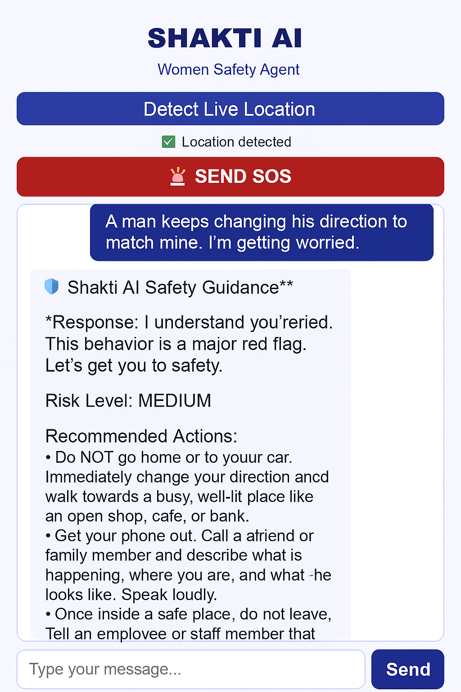

# SHAKTI AI — Women Safety Agent Powered by Multi-Agent LLM Workflows  
### Kaggle x Google Agents Intensive Capstone Project  
**Track: Agents for Good**

SHAKTI AI is an intelligent Women Safety Agent that sends SOS alerts, detects real-time GPS location, and provides Gemini-powered crisis reasoning.  
Built using a **React Frontend + Node.js Backend** with multi-agent logic, SHAKTI AI acts as an autonomous safety companion for women during emergencies.

---

## 🚨 Problem

In emergency situations, victims often cannot:

- call for help  
- type messages  
- share location  
- explain what’s happening  
- think clearly due to panic  

Traditional SOS apps require **manual actions**, which fail during real panic.

There is a need for a system that can **think, react, and help automatically**.

---

## 🛡️ Solution — SHAKTI AI

SHAKTI AI provides:

### ✔ Real-time GPS location detection  
### ✔ One-tap SOS alert  
### ✔ Gemini-powered crisis reasoning  
### ✔ Memory-based conversation understanding  
### ✔ Nearby Police & Hospital Finder (OpenStreetMap API)  
### ✔ Multi-agent safety actions  

The system processes user messages, evaluates danger level, retrieves nearby emergency locations, and guides the user through safe next steps.

---

## Multi-Agent Logic 
SHAKTI AI uses **3+ agents** inside a single orchestrated backend (`server.js`):

### **1️⃣ Heuristic Danger Agent**
- Analyzes keywords (attack, follow, grab, unsafe, etc.)
- Evaluates time-of-day risk
- Produces LOW / MEDIUM / HIGH danger score

### **2️⃣ Gemini Crisis Reasoning Agent**
- Understands user messages
- Uses memory (last 5 messages)
- Generates JSON-based:
  - danger level  
  - reply  
  - recommended actions  

### **3️⃣ Nearby Location Agent (Tool)**
- Uses OpenStreetMap API  
- Finds nearest police stations  
- Finds nearest hospitals  

### **4️⃣ SOS Agent**
- Sends location + emergency message  
- Simulates alert workflow  
- Designed for future Twilio/WhatsApp integration  

Together these form a complete **multi-agent emergency response system**.

---

## 🖥️ Tech Stack

### **Frontend**
- React (Vite)
- TypeScript
- CSS UI
- Fetch API

### **Backend**
- Node.js  
- Express  
- CORS  
- dotenv  
- winston logger  

### **AI**
- Google Gemini (`@google/genai`)  
- Custom JSON-only prompt engineering  
- Memory + reasoning + safety planning  

### **Tools**
- OpenStreetMap API  
- Custom memory store  
- Custom risk assessment heuristic  

---

## 🔧 System Architecture
frontend/ (React)
│
│-- App.tsx → UI + SOS button + location + chat
│-- main.tsx → React root
│-- index.html → Main HTML container
│
backend/ (Node.js)
│
│-- server.js → Multi-agent logic, Gemini, danger scoring, OSM API
│-- package.json → Backend dependencies
│
assets/
│-- shakti-ui.png → UI screenshot (to be uploaded)

## 🔄 Data Flow
User → React UI
→ /ask-agent
→ heuristic agent
→ Gemini agent
→ nearby police/hospital tool
→ JSON safety response
→ UI displays reply + actions + risk level

SOS Button → /sos
→ SOS Agent triggers emergency workflow (simulated)

---

## 🚀 Features 

###  Multi-agent system  
###  Custom tools (OSM, memory, risk evaluator)  
###  Conversation memory  
###  Crisis reasoning with Gemini  
###  JSON-formatted LLM output  
###  SOS emergency workflow  
###  Full-stack architecture  
###  Clean documentation  

---

## 🖼️ Screenshots

### 🔹 Main UI

### 🔹 Low-Risk Scenario

### 🔹 Medium-Risk Scenario

### 🔹 High-Risk Scenario

### 🔹 SOS Alert Response

### 🔹 SOS Trigger Event

